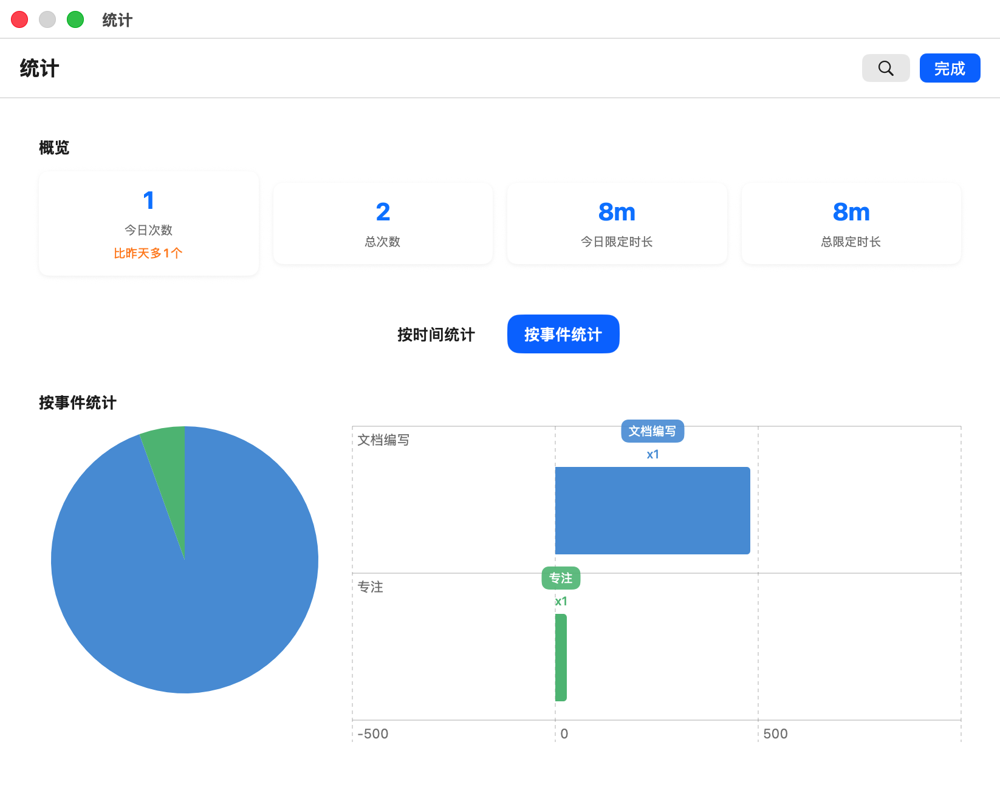
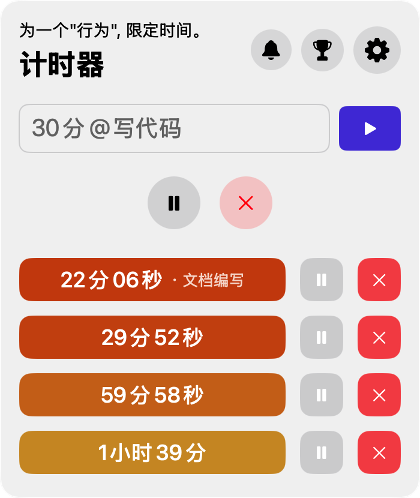

  

# barTimer——Mac上的快捷任务栏限定计时器

> 在macOS 的任务栏上使用"自然语言"输入快速设置限定倒计时的工具。

 

干着干着就摸鱼去了?
自己沉浸到其他事件忘记了时间?
做事越来越慢？效率越来越低？
没有时间观念，让你办事效率越来越低，无法养成在规定时间内完成指定的任务的习惯。

 

**使用 barTimer，在菜单栏直接输入自然语言「20min」「1h30m」「40分钟」「10分钟20秒」即可开始计时，无需打开完整应用。你可以混合输入，怎么快怎么方便。**

---

## ✨ 功能特性

- **自然语言输入**：支持「20min」「1h30m」「90s」「90秒」「四十分钟」「10分钟20秒」等格式
- **多计时器支持**：可以同时设置多个计时器，批量管理
- **事件绑定**：输入「20min @开会」或「20min 开会」，计时与事件名称关联
- **菜单栏实时显示**：最近计时器的剩余时间直接显示在菜单栏
- **历史记录**：查看过去所有计时记录，统计数据按事件类型统计时间分配
- **专注计时白噪音**：计时时可开启时针转动白噪音，感受时间的流逝。计时结束时弹出全屏通知窗口，让你清楚知道计时结束。
- **任意界面快捷键呼出**：全局快捷键呼出，快速输入指令计时。
- **iCloud 同步**：计时数据跨设备同步（未来支持）

---

## 💻 环境要求

- macOS 13.0 及以上

## 任意界面快捷呼出

## 统计界面

## 多计时器支持

